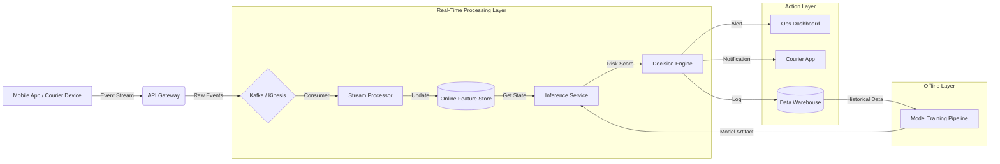

# Real-Time System Architecture

**Project:** Large-Scale Last-Mile Delivery Analytics  
**Stage:** STAGE 4 - System Design

---

## 1. High-Level Diagram

---

## 2. Component Specifications

### A. Data Ingestion (Event Stream)
*   **Technology:** Apache Kafka / AWS Kinesis
*   **Topic:** `delivery-events-v1`
*   **Throughput:** Capable of handling peaks (e.g., 10k events/sec during 11.11 sale).
*   **Format:** JSON (Avro/Protobuf for efficiency in future).

### B. Online Feature Store (State)
*   **Technology:** Redis (for low latency) or Feast (managed feature store).
*   **TTL:** Keys expire 24h after delivery completion.
*   **Schema:** Key=`task_id`, Value=`FeatureVector` (Protobuf/Hash).

### C. Inference Service (Prediction)
*   **Technology:** Python (FastAPI) or Triton Inference Server.
*   **Model:** XGBoost (converted to ONNX for faster C++ runtime if needed).
*   **Latency Budget:** Max 50ms p99.
*   **Scaling:** Horizontally scalable (Kubernetes pods).

### D. Decision Engine (Action)
*   **Logic:** Stateless microservice applying business rules (`alert_policy.md`).
*   **Outputs:** events to `action-queue` topic (decoupling decision from execution).

---

## 3. Data Flow Scenario

1.  **Event:** Courier 123 ping: "Arrived at Pickup" (Timestamp: 10:05 AM).
2.  **Stream Processor:** Updates Feature Store for Task T-999 (`pickup_time` = 10:05).
3.  **Trigger:** Processor calls Inference Service.
4.  **Inference:**
    *   Fetches Features: `distance=5km`, `hour=10`, `courier_speed=avg`.
    *   Model Predicts: `Prob(Late) = 0.78`.
5.  **Decision:** Score > 0.70 -> **CRITICAL**.
6.  **Action:**
    *   Send WebSocket alert to Dispatch Dashboard.
    *   Log "High Risk Event" to Warehouse.

---

## 4. Transition to Production

To move from this simulated Python codebase to Production:

1.  **Replace `event_simulator.py`** with actual Kafka Consumers.
2.  **Replace `online_feature_store.py` (Dict)** with production Redis cluster.
3.  **Wrap `realtime_inference.py`** in a FastAPI/Flask container.
4.  **Implement Logging:** All predictions must be logged (`prediction_id`, `input_features`, `score`) for drift monitoring.
